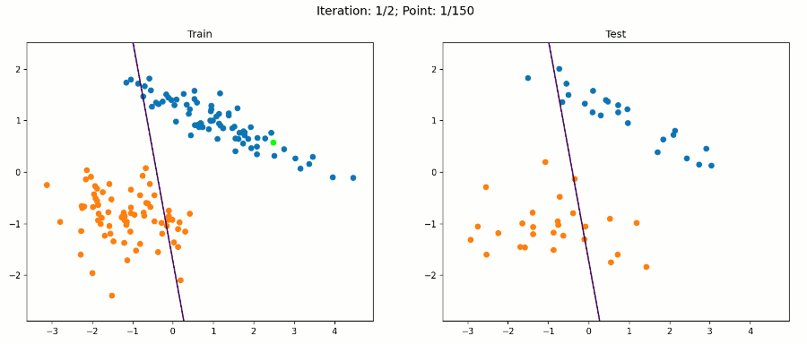

# Machine-Learning

In this repasetory we will learn and study codes and implementations of pattern classifications using multilayer perceptron in python. My learnings can be found on my [poster](https://alpaynatanael.github.io/posters/MNT_Poster_v2.pdf)

This folder also includes class notes from the Graduate Machine Learning class at University of California Irvine. 

